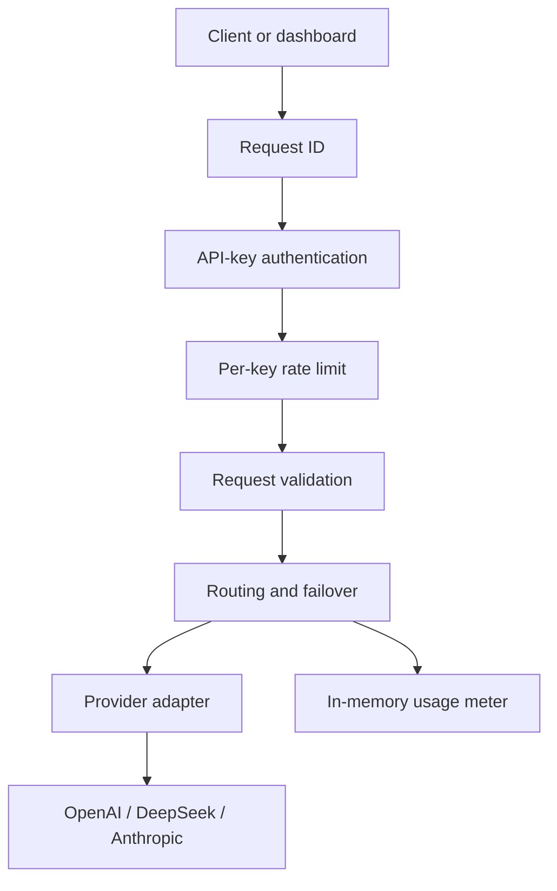
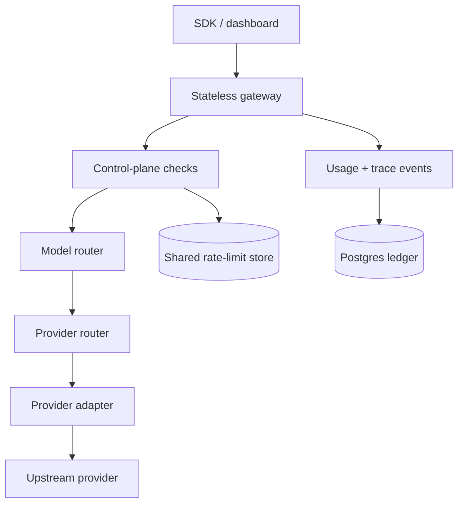

# VishRouter Architecture

## Current request path

The current implementation is intentionally single-process. Authentication configuration, rate-limit buckets, and usage totals live in the gateway process. This is safe for local/private use but not durable or globally consistent.

## Target architecture

### Data plane

- Stateless HTTP admission and OpenAI compatibility.
- Request validation, streaming, timeouts, cancellation, and normalized errors.
- Model router, provider router, retry budget, and circuit breakers.
- Provider adapters that translate requests, responses, streams, and errors.

### Control plane

- Users, organizations, memberships, API keys, scopes, and revocation.
- Quotas, budgets, BYOK credentials, pricing versions, and policy definitions.
- Provider/model catalogue, capabilities, routing strategies, and health state.

### Observability plane

- Idempotent usage events and request traces keyed by request ID.
- Provider attempt records, token counts, cost, TTFT, duration, and outcome.
- Metrics, structured logs, analytics, reconciliation, and alerts.

## Two-stage routing contract

1. **Model router** filters models by requested ID or virtual model, modality, context, tools, structured output, and reasoning needs.
2. **Provider router** chooses an upstream for that model using health gates and a strategy such as cheapest, fastest, reliable, or balanced.

Canonical identifiers will use explicit namespaces:

- `openai/gpt-*`
- `anthropic/claude-*`
- `deepseek/deepseek-*`
- `vishrouter/auto`
- `vishrouter/cheap`
- `vishrouter/fast`
- `vishrouter/best`
- `vishrouter/coding`
- `vishrouter/reasoning`

Prefix matching remains compatibility behavior, not the target source of truth.

## Adapter contract

Each adapter family owns only provider wire behavior:

- Build and sanitize a request.
- Translate non-streaming responses.
- Translate streaming events.
- Normalize provider errors and token usage.
- Declare supported capabilities.

Routing policy must not contain provider-specific payload translation.

## Persistence boundaries

Postgres is the source of truth for keys, organizations, policies, pricing versions, request traces, and usage events. A shared low-latency store is used for distributed rate limits and short-lived health/circuit state. The system must continue to route with a cached read-only control-plane snapshot during a temporary database read outage, while refusing operations that could violate budgets.

## Streaming invariants

- No downstream SSE headers or bytes before an upstream is committed.
- Failover is allowed only before commitment.
- After commitment, errors travel as an SSE error frame followed by `[DONE]`.
- Client disconnect aborts the upstream request.
- Backpressure and idle timeouts are enforced.
